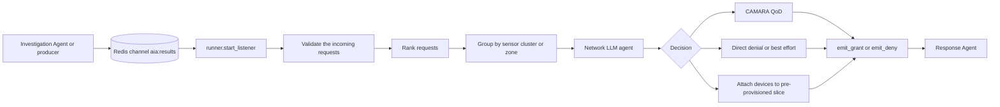

# AquaPulse Network Agent

The Network Agent (NMA) is AquaPulse's autonomous network-resource orchestrator. It protects the communications path used by water-pipeline monitoring and emergency response systems by deciding when a device or group of devices needs an explicit cellular-network guarantee.

Its objective is to:
- prioritize telemetry and emergency valve-actuation traffic for important incidents;
- select the most suitable mechanism: no allocation, Quality on Demand (QoD), or a 5G network slice;
- account for device reachability, asset criticality, severity, confidence, and regional congestion;
- emit a structured grant or denial decision for every actionable request;
- avoid allocating resources to offline or unreachable devices and provide SMS fallback when appropriate.

## High-Level Architecture



## Input Contract

### Batch input

```json
{
  "batch_id": "batch-2026-001",
  "analysis_timestamp": "2026-09-08T12:00:00Z",
  "total_clusters_analyzed": 2,
  "anomalies_detected_count": 1,
  "investigated_threats": [
    {
      "anomaly_id": "anomaly-123",
      "sensor_cluster_id": "cluster-47.49_19.08",
      "segment_id": "segment-17",
      "device_id": "+99999991000",
      "classification": "CRITICAL_PIPE_BURST",
      "severity_tier": 3,
      "network_status": {
        "device_online": true,
        "device_reachable": true,
        "network_degradation_detected": true,
        "camara_device_status": "ONLINE",
        "camara_reachability_status": "REACHABLE"
      },
      "physical_deviations": {
        "pressure_drop_pct": 42.0,
        "flow_surge_pct": 35.0,
        "pressure_slope": -1.2,
        "flow_slope": 0.9
      },
      "criticality_metrics": {
        "criticality_score": 5,
        "proximity_to_reservoir_m": 120.0,
        "population_served": 50000,
        "associated_valve_id": "valve-17"
      },
      "operator_justification": "Rapid pressure loss near a high-impact segment.",
      "confidence_score": 0.98
    }
  ]
}
```

### Workflow state

The internal LangGraph state contains:

- `raw_requests`: requests after collection;
- `ranked_requests`: the same requests sorted for processing;
- `regional_batches`: requests grouped by `sensor_cluster_id`, or `zone_id` when no sensor-cluster ID exists;
- `messages`: LangChain messages used to prompt and run the LLM agent.

## Collection, Ranking, and Grouping

### Collection

`RequestCollector` is currently instantiated per workflow invocation with a maximum batch size of 10 and a maximum wait time of 2 seconds. In the current graph path, all requests are added and then immediately read with `get_batch()`. The collector also contains flush rules for a full batch, a tier-3 request, or elapsed wait time, but no long-lived queue currently invokes `should_flush()`.

### Ranking

Requests are sorted in descending order by:

1. `severity_tier`;
2. `criticality_metrics.criticality_score`;
3. `confidence_score`.

Missing ranking fields default to zero.

### Regional grouping

Requests are grouped by `sensor_cluster_id`, falling back to `zone_id`, and finally to `zone-unknown`. The first device in each group becomes the representative device used for regional congestion checks.

## LLM Decision Policy

The network agent uses Groq through `ChatGroq` with the `openai/gpt-oss-120b` model and temperature `0`. Its system policy is to:

- use the pre-provisioned slice for highly critical, sustained, or multi-device coordination scenarios;
- use QoD for a lightweight, rapid priority request for a single device or moderate spike;
- use best effort or deny for routine traffic, non-critical alerts, or cases where allocation is not worthwhile;
- check regional congestion before escalating priority;
- never allocate to an offline or unreachable device;
- retry a failed tool call exactly once, then deny with SMS fallback;
- require QoD to return exactly `AVAILABLE` before emitting a grant; `REQUESTED`, `UNAVAILABLE`, and `FAILED` results become denials;
- pass the original `device_id` into every grant or denial and never invent it;
- process every request in the input batch and never fabricate allocation identifiers or timestamps.

For a successful allocation, the agent must call the allocation tool first and then `emit_grant`. For a denial, it calls `emit_deny` directly.

## Network Tools and Integrations

### Congestion check

`check_congestion` creates a CAMARA congestion-insights subscription and queries the congestion level using the regional representative device. It returns the zone, representative device, and congestion level, or a failed status and error.

### QoD

`request_qod` creates a CAMARA QoD session between a device and application server. By default it waits for the gateway to move from `REQUESTED` to a terminal status for up to 20 seconds. The result includes the session ID, status, QoS profile, start time, and expiration time.

### Network slicing

`request_network_slice` attaches target devices individually to an already operating slice. It uses the explicit `PREPROVISIONED_SLICE_ID` created previously. Each device result contains its phone number, IMSI, attachment resource ID when available, and attachment status. The tool returns `COMPLETED` after all device attachment attempts have been processed.

### Decision emission

- `emit_grant` returns `status: GRANTED` and a `NetworkGrant` decision containing the guarantee type (`QoD` or `slice`), session ID, timestamps, severity, and reasoning.
- `emit_deny` returns `status: DENIED` and a `NetworkDenied` decision containing the reason, denial timestamp, and `SMS` or `none` fallback.
- Both tools return JSON strings containing `device_id` and `decision`, which `dispatch_to_response` parses from LangChain `ToolMessage` objects.

### Response Agent dispatch

`dispatch_to_response` runs after the LLM node. It dispatches all grants and denials to the Response Agent through a background thread pool. The bridge converts each decision into the Response Agent's grant/denial schema and invokes `build_actuation_graph()` without blocking the network workflow.

### Network release API

`release_server.py` exposes:

| Endpoint | Behavior |
| --- | --- |
| `POST /v1/qod/release` | Deletes the QoD session identified by `session_id`. |
| `POST /v1/slice/release` | Deactivates, waits for availability, and deletes the slice identified by `session_id`. |
| `GET /healthz` | Returns `{"status": "ok"}`. |

The release request body is `{"session_id": "...", "incident_id": "..."}`. Failures are returned as HTTP 502 responses.

## Outputs

The runner does not publish a separate response message to Redis, since the grants and denies are sent to the Response Agent directly. Their objects are returned inside tool messages and then dispatched asynchronously to the Response Agent.

Typical decision shapes are:

```json
{
  "status": "GRANTED",
  "decision": {
    "cluster_id": "cluster-47.49_19.08",
    "incident_id": "anomaly-123",
    "severity_tier": 3,
    "guarantee_type": "QoD",
    "session_id": "qod-session-id",
    "granted_at": "2026-09-08T12:00:05Z",
    "reasoning_trace": "Critical reachable device requires temporary priority under current congestion.",
    "expires_at": "2026-09-08T13:00:05Z"
  }
}
```

```json
{
  "status": "DENIED",
  "decision": {
    "cluster_id": "cluster-47.49_19.08",
    "incident_id": "anomaly-123",
    "severity_tier": 2,
    "reasoning_trace": "Allocation was denied because the target device is unreachable.",
    "fallback": "SMS",
    "denied_at": "2026-09-08T12:00:05Z"
  }
}
```

## Configuration

The agent loads environment variables with `python-dotenv`. Relevant settings include:

| Variable | Used by |
| --- | --- |
| `GROQ_API_KEY` | LLM tool-calling agent. |
| `RAPIDAPI_HOST` | Network as Code client. |
| `RAPIDAPI_KEY` | Network as Code client. |
| `CONGESTION_NOTIFICATION_URL` | Congestion subscription callback. |
| `CONGESTION_NOTIFICATION_AUTH_TOKEN` | Congestion subscription authentication. |
| `WEBHOOK_URL` | Slice notification webhook base URL. |
| `NOTIFICATION_AUTH_TOKEN` | Slice notification authentication. |
| `APP_SERVER_IPV4` | Default QoD application-server address (`233.252.0.2`). |
| `PREPROVISIONED_SLICE_ID` | Runtime-selected active slice ID; set by startup pre-provisioning and used by the slicing tool. |
| `DEFAULT_DEVICE_MSISDN` | Fallback sandbox phone number for unmapped identifiers. |

## Running the Agent

From the repository root, install the dependencies from the relevant requirements file and ensure Redis is available at `localhost:6379`. Then start the listener with:

```powershell
python -m agents.network_agent.runner
```

The runner first checks or creates the pre-provisioned mission-critical slice and waits for `OPERATING`. Run the release API separately when response-agent release requests must be served:

```powershell
uvicorn agents.network_agent.release_server:app --host 0.0.0.0 --port 8000
```

